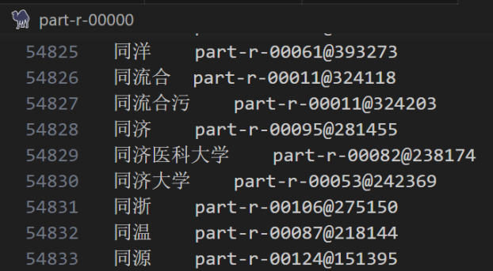

# Project Overview

- keywords: TF-IDF; Inverted Index; MapReduce

The objective of this project is to develop a search engine using `MapReduce` to crawl a website and implement keyword-based searching of webpage content. The purpose of the search engine is to provide the most relevant webpages based on the keywords entered by the user. **A simple approach is to calculate the frequency of each word in the webpage and sort the webpages based on the word frequency.** Whenever a user enters a keyword, the webpage with the highest word frequency is returned. However, this method cannot handle common words well and does not properly handle multiple keyword searches. Therefore, the experiment uses `TF-IDF` as a measure of the relevance of keywords to webpages.

Considering that webpage titles often represent the content of the webpage, the calculation of TF-IDF values in the experiment does not directly use word frequency but uses a weighted form of word frequency: words appearing in the title are weighted 100 times more than words appearing in the body. This weighted word frequency is referred to as "rank."

The next consideration is how to obtain webpage information obtained by the `crawler` when a user enters a query. Since the volume of webpage information obtained by the crawler is very large, it is not acceptable to read and parse the entire webpage each time. Therefore, it is necessary to pre-calculate word frequency and other information using an **inverted index**. Since the original file size obtained by the crawler is very large, it is possible to use MapReduce to complete the indexing work.

Inverted indexes also cannot effectively reduce file size. Since the inverted index contains partial word frequency information, the file size of the inverted index is often larger than the original file. However, since the information in the inverted index is grouped and aggregated based on words, a secondary index can be built on the inverted index. In practice, the file size of the secondary index is completely acceptable.

Finally, we design the MapReduce server according to the objectives for indexing, and then design the corresponding client.

The code structure for the server and client is as follows:
```
├── client
│ └── App.java
├── io
│ ├── StopWords.java
│ ├── TokenInfoClient.java
│ ├── TokenInfoMap.java
│ └── TokenInfoReduce.java
└── server
├── Driver.java
├── PosTF.java
└── SecondaryIndex.java
```

### Specific Experimental Process

1. Webpage Crawling and Processing:
   - The main purpose is to use a crawler to obtain webpage data from the Internet. 
   - After obtaining the data, it is processed for **deduplication, cleaning, concatenation**, etc., to be applied to subsequent experiments. 
   - Overall, this crawler is designed with **multi-threading** for significantly improved speed compared to single-threading. 
   - The code is primarily written in Java, mainly for crawling a news website and storing news from the website in a specific format.

2. Building an Inverted Index:
   - The project generates inverted index files through Job1.
   - The input is the crawled a.txt, b.txt, c.txt... files, each in the format:
     ```
     <url>[SEP]<source>[SEP]<date>[SEP]<title>[SEP]<content>
     ```
   - The output is inverted index files part-r-00000, part-r-00001, part-r-00002..., in the format:
     ```
     <token> <idf>|[<rank>@<line_offset>@<filename>@[<word_offset>];...]
     ```

   

   

3. Building a Secondary Index:

   - The project generates a secondary index file through Job2.
   - The input is the inverted index files part-r-00000, part-r-00001, part-r-00002..., in the format:
     ```
     <token> <idf>|[<rank>@<line_offset>@<filename>@[<word_offset>];...]
     ```
   - The output is a secondary index file in the format:
     ```
     <token> <index_filename>@<line_offset_in_index>
     ```
     
     

4. Entry Point of the Program:
   - Reads the input files, primary index files, and secondary index file locations at the start.
   - Writes the total number of files into the configuration `conf` for use in subsequent MapReduce Jobs.
   - Executes 2 Jobs sequentially, exiting if there is a failure. Here, a check is made for the existence of paths for two purposes: firstly, if the output path already exists, Hadoop will throw an exception. This is because Hadoop is designed to allow users to write once and read multiple times, so if you need to rewrite, you need to manually remove this directory. Secondly, if you delete all directories every time you restart, it is wasteful because often we only want to re-run one or two Jobs (such as error recovery). For large datasets, keeping some intermediate results can save a lot of time when re-executing.

5. Online Query Processing:
   - The online processing part of the search engine needs to handle a user's input sentence and segment the sentence. 

   - Based on the obtained keywords and information in the index files, the search engine sorts the webpages where the keywords appear and finally displays the webpages with the highest relevance to these keywords. 

   - The specific query process is as follows:
     1. The user enters a query sentence, and the search engine tokenizes it and determines whether the obtained keywords are stop words.
     2. Opens the secondary index file, locates the keyword information in the inverted index file, and maintains a list storing TF-IDF values and webpage information (original filename, line offset, and word offset). Opens the inverted index file at the corresponding position, gets the keyword's IDF and rank (weighted word frequency) in the original webpage, and stores the top 10 webpage information with the highest rank and TF-IDF values into the list.
     
     search result:
     
     

# Collaborator

